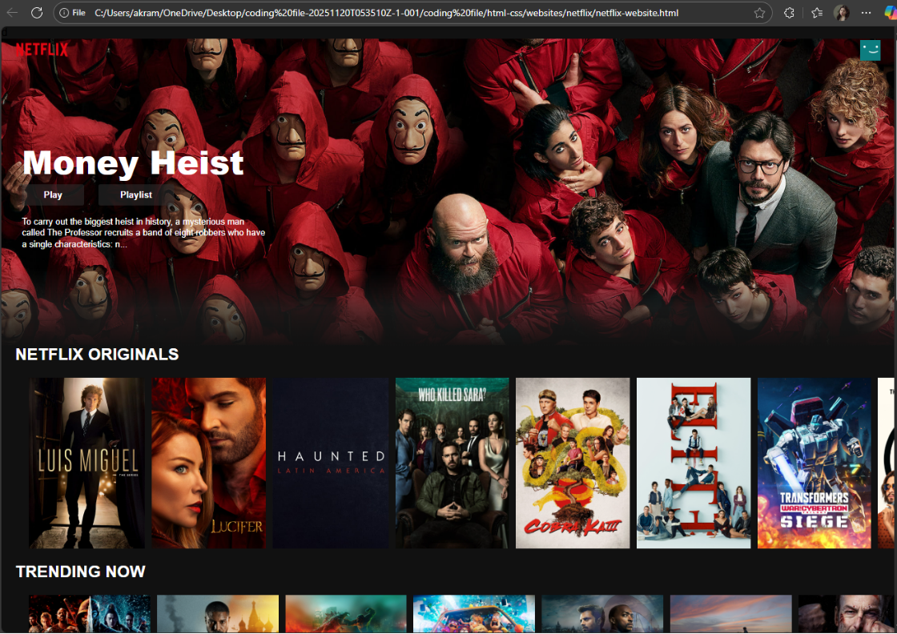

# Netflix Clone

A responsive front-end clone of the Netflix landing page built using HTML and CSS. This project was developed to practice recreating real-world streaming platform interfaces and strengthen front-end web development skills.

## Preview



## Features

- Responsive landing page design
- Hero banner section
- Movie and TV show content rows
- Navigation bar
- Modern streaming platform UI
- Mobile-friendly layout

## Technologies Used

- HTML5
- CSS3

## Project Structure

```text
netflix-clone/
│
├── index.html
├── css/
│   └── style.css
├── images/
├── screenshots/
└── README.md
```

## Learning Outcomes

Through this project, I learned:

- Responsive web design
- CSS Flexbox and Grid
- Hero section creation
- Layout recreation from real-world websites
- Front-end development best practices

## Future Improvements

- Add JavaScript interactions
- Create movie detail pages
- Implement authentication system
- Integrate movie data using APIs
- Rebuild using React.js

## Author

Akram Jha

Computer Science Graduate
